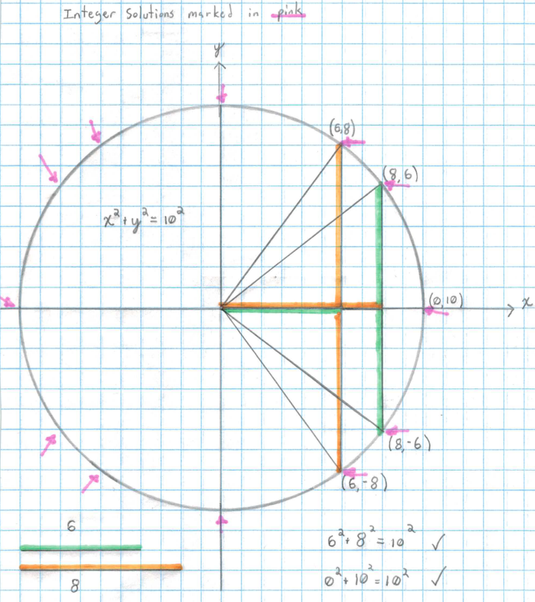
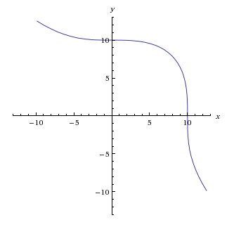

Whether, and Why, Fermat's Last Theorem is Important
===================================================e

## Intruduction

I recently had a conversation with an English teacher about Fermat's last theorem.  She will soon be teaching a play that references the theorem (*Arcadia*, by Tom Stoppard), and had apparently been attempting to understand it by reading about Andrew Wiles' proof.  She mentioned that she didn't yet see what elliptic curves had to do with it.  I didn't have the heart to tell her that his proof is about as inaccessable to the non-mathematicioan as a challenging work of philosophy--written in Old English--would be to the modern English speaker (that is to say, totally).  

I find that my mathematics education (a nearly-complete undergraduate degree) has not armed me with the critical mass of vocabulary necessary to even take a shot at Wiles' proof.  I know what rings and fields are, and I can spell Galois, but I stub my toe on "modular forms".  Most working mathematicians would get further than myself, but unless they specialize in the right area, I expect they would come across similar problems.  Apart from the challenge of simply knowing what all the words mean, I'm sure Wiles' proof poses a certain conceptual challenge as well.  I doubt that it's a walk in the park.  Unfortunately, mathematicians tend to specialize so completely that few are likely to know the right dialect of Number Theory to even say one way or another.  With this in mind, perhaps I should warn her about what she is getting into--so as not to have her waste her time.

On the other hand, the willingness to engage with advanced mathematics is uncommon outside of the discipline.  Too often I find myself exiting a classroom--equations still on the board--and hear somebody entering say "I'm not smart enough for whatever *that* class is about."  They mistake not knowing the language with being unable to handle the concepts.  This is a common perception, and I hate it because it drives people away from mathematics.  I appreciate that my Engish-teaching-friend has not fallen into this trap, so I can't in good conscience shut her down about it.

Fortunately, one can have an appreciation for why Fermat's last theorem is cool, without being able to prove it.  Only a basic algebraic competence should be necessary for that appreation.  In this paper I intend to package the necessary bits for my friend the English teacher and, by proxy, her students.  It is my hope to equip them with enough context for the theorem that they notice a few of the subtleties that I'm sure Stoppard has included in the play.  Also, courses for non-math-majors in the USA are calculation-based provide very little insight into the activities of the pure mathematician (which Fermat was).  I hope to provide some insight into various norms surrounding that body of discourse in order to dispel any notion among the students that these are men with especially powerful calculators, and hopefully provoke a little curiosity along the way.

## The Conjecture

### Context

Fermat's claim was found in a copy of *Arithmetica* by Diophantus of Alexandria (written in the third century C.E.).  It is basically a bank of problems together with descriptions of how to solve them.  I found [a translation](https://ia802605.us.archive.org/34/items/diophantusofalex00heatiala/diophantusofalex00heatiala.pdf) and took a crack at Book II, problem 6, which reads:

> To find two numbers having a given difference and such that the difference of their squares 
> exceeds their difference by a given number.

The same problem might be stated differently in a modern high school algebra book (see below).  I was pleased to find that I could solve it.

> Use the following system of equations:
> 
> a - b = c
> a^2 - b^2 = c + d
> 
> 1) Find an expression for a in terms of c and d
> 2) Find an expression for b in terms of c and d

It was not the margin for II.6 that Fermat used to make his claim--it was II.8.  I have included a different problem here to point out that there are no references to triangles here.  The formula for Fermat's Last Theorem (hereafter FLT) bears a striking resemblance to the Pythagorean Theorem.  And perhaps, in a round-about way, they are indeed related.  One might ask if Diophantus' would have included a sum of squares problem in his book if the Pythagorean school hadn't made such problems geometrically interesting.  Still, if Diophantus held triangles in his head while he penned this problem, he at least was not explicit about it.  Here is the problem:

> To divide a given square number into two squares

Or in modern parlance:

> Given a value for c^2, find a solution to the following equation: a^2 + b^2 = c^2

And here is the method of solution given by Diophantus:

> Given square number 16.
> x^2 one of the required squares. Therefore 16-x^2 must be equal to a square.
> Take a square of the form (mx - 4)^2, m being any integer and 4 the number which is the square 
> root of 16, e.g. take (2x - 4)^2, and equate it to 16 x^2.
> Therefore 4x^2 - 16x + 16 = 16 - x^2
> or 5x^2 = 16x, and x = 16/5.
> 
> The required squares are therefore 256/25, 144/25.

The first thing that jumps out at me here is that Diophantus considers the ratio of what we would call "perfect squares" to be itself a square.  This is not how we usually use that word.  It's easy enough to get your head around the modification, but it does bring to mind a concern:  We are communicating with a man who is eighteen hundred years dead, and never spoke english--what other pieces of the puzzle might our modern view be masking?  

I think that one of the really cool things about math is that it relies on context so weakly.  A notion, properly expressed in mathematics, can stand on its own more completely than any other means of expression that I am aware of.  Nothing exists totally in a vacuum, however, especially not this problem.  As it turns out, Diophantus did not accept irrational numbers, negative numbers, or even zero.  To Diophantus, a number must be expressed as the length of a line segment, anything else was absurd.  This is a pretty radical departure from what we do today.

It explains why he didn't bother ask whether the solution was rational (which it would have to be in order for his use of "square" to hold up)--which is the second thing to come to mind when I examine his method.  Despite having lived 800 years after the Pythagorean school discovered (and tried to keep secret) the existence of irrational numbers--their use still wasn't considered legitimate enough for Diophantus ("The Father of Algebra") to bother mentioning them.  

The last thing that strikes me about Diophantus' work is how comfortably he calls in his variable *m*. Implicit in his construction is the fact that each square can be decomposed into the sum of two "squares" in an infinitude of ways.  That is a remarkable property for any construction and I think that Diophantus' lack of remark on it indicates another siginificant difference in attitude between his time and ours.

### Formation

The first departure that Fermat made from Diophantus' is that he restricted the kind of answers he would accept to integers.  For the form that Diophantus had written (that is, the n=2 case of FLT) this meant that Fermat was interested in Pythagorean Triples--triples of integers that satisfy the pythagorean theorem:  

> a^2 + b^2 = c^2

To understand why Fermat restricted his focus to integers, we will consider an example.  Notice that any values of *x* and *y* that satisfy the equation below will satisfy the pythagorean theorem.  That is, they could be the side lengths of a right triangle whose hypotenuse has length ten.  Also notice that this is the equation for a circle whose radius is 10.

> x^2 + y^2 = 10^2 

It is an easy task to graph such a circle. One can then pick any point on it and find the *x* and *y* coordinates of that point, and *Voila!* they will have found a solution.  Nobody, so far as I know, has gained deep insight into the algebraic structure of the numbers we use every day by tackling problems so easy as that.  The kind of situation that arises in a mathematical mind here is, well, hardly a situation at all.  There's nothing do do, no opportunity for creativity--that's just how graphs work.  But you might instead ask, "how many points, amid this infinity of solutions, happen to have integers for both coordinates?"  Now things are getting interesting: there are only twelve such points. 

To visualize this, plot the circle on some graph paper so that the unit size of the grid is equal to the unit size of the circle.  Any place where the circle passes through the intersection of two points represents one of the integer solutions that I am talking about.  I have indicated these places in pink.

From this point, many more questions begin to emerge:  Why twelve?  Would the situation be different if we used x^2 + y^2 = 11^2? (This gives four integer solutions.)  How about x^2 + y^2 = 65^2?  (This gives 28.)  Or, the route Fermat took:  What happens if we change the exponent?

Well, if we decrease the exponent we get a line through the points (0,c) and (c,0).  As long as c is an integer, there will be infinitely many integer solutions ((c,0), (c,1), (c,2), (c,3) to name just a few).  It would seem that decreasing the exponent makes for *more* solutions--and ones that are easier to find too.  We might then wonder if increasing the exponent gives us fewer solutions still.  I have graphed such a curve for n=3 and c=10:

Well, I'm not really sure what that is.  I can say for sure that it is *not* some kind of 3D pythagorean thingy, as it is not clear what sort of 3d shape has only three side lengths, and we have no reason to believe that anything the pythagoreans said should apply to it.  We still get (0,10) and (10,0) as integer solutions, but these are easy to find and yet tell us nothing about the rest of the solutions (if they exist at all), so we call them *trivial* solutions and focus elsewhere.  All I can say is that no non-trivial solutions jump out at me, and neither does a method for finding any.  Nor does any method for proving they don't exist present itself immediately.  Because there is no such thing as proof by I-tried-really-hard-and-I-can't-find-any, I would have to spend some time at this stage in my investigation.  Fermat, however, has sharper intuition than myself and--whether or not he actually had a valid proof--was at least able to feel confident that his claim was true.

Mathematical intuition is a difficult thing to convey to people who haven't experienced it.  As far as I am aware, you just have to prove a whole bunch of things, and at some point you begin to get a feel for which line of inquiry will take you to interesting results, and which one is likely to be a dead end.  I cannot claim to know the first thing about the intuition of the great Pierre de Fermat, but he and I agree about what changes we would make to Diophantus II.8 in order to make the problem more interesting, so that's something.  

So as to explore the type of things that mathematicians like Fermat get into, let us pretend that there actually were solutions for n=3, but that they were wickedly hard to find.  Let us suppose further that Fermat did not know whether integer solutions existed for n=4 or not.  In this case the game would have been different: determine whether all values of n give integer solutions.  If it turns out that solutions get harder and harder to find as n increases, and eventually stop happening, the next obvious task would be to find the highest value of n that gives any integer solutions.  From that point, one might follow in Diophantus' footsteps and devise a method of finding them--although today we would not be content with finding *an* answer, we would probably attempt to uncover some description of all possible answers.

This didn't happen though.  Fermat saw that no integer solutions could exist for n=3 and up, and wrote in the margin of Diophatus:

> It is impossible to separate a cube into two cubes, or a fourth power into two fourth powers, 
> or in general, any power higher than the second, into two like powers. I have discovered a 
> truly marvellous proof of this, which this margin is too narrow to contain

